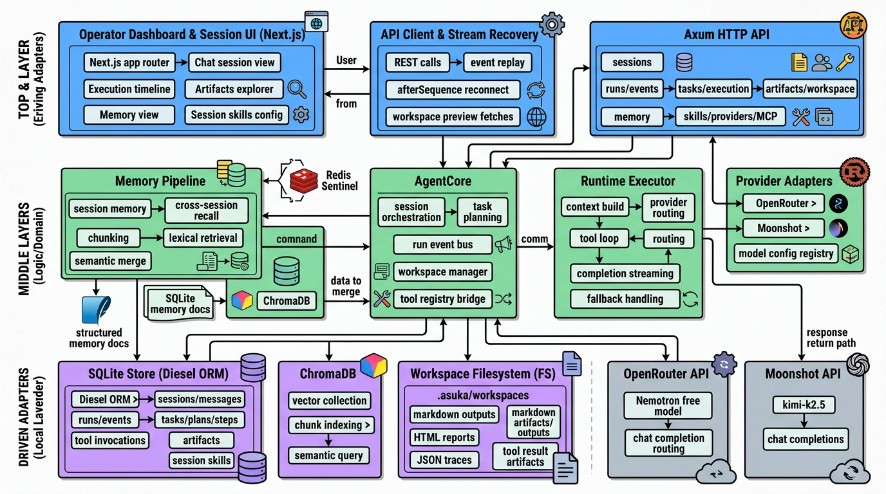
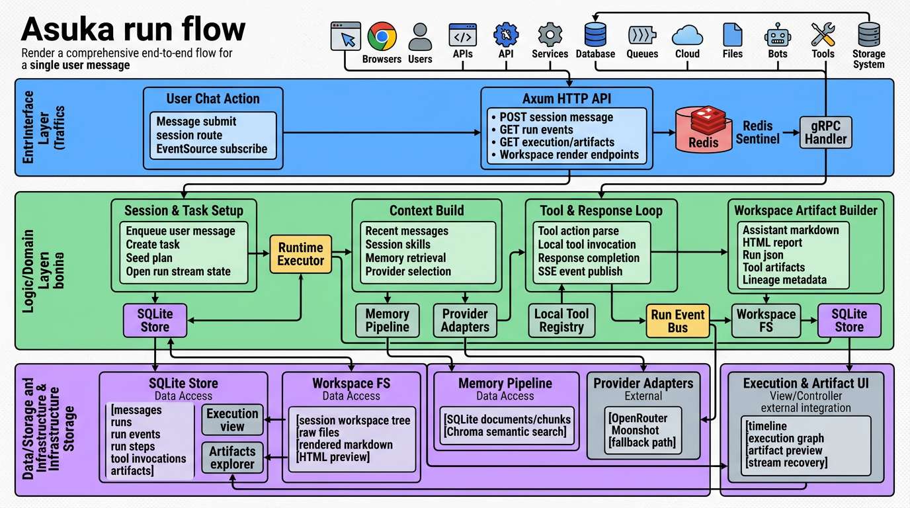

# Asuka

Asuka is a local-first agent workspace for building and operating a structured AI harness. It combines a Rust backend, a reusable `agent-core` runtime, a Next.js operator UI, durable local storage, resumable streaming, workspace artifacts, and session-scoped skill configuration.

The project is designed for a single user running locally. It favors fast iteration, transparent execution, and inspectable outputs over opaque chat-only behavior.

## What It Can Do

- Run a session-based agent with durable `session`, `task`, `plan`, `run`, `run step`, `tool invocation`, and `artifact` records
- Stream run events to the frontend over SSE, with persisted event history and replay after refresh
- Manage session-specific skill policy and bindings, including effective skill resolution
- Persist chat state, execution state, artifacts, and memory in local SQLite through Diesel ORM
- Support session-scoped short-term memory and cross-session long-term memory with optional ChromaDB semantic retrieval
- Call real upstream model providers through OpenRouter and Moonshot, with configurable provider/model metadata in [`config/models.toml`](./config/models.toml)
- Execute local tools such as file reads/writes, listing, ripgrep, globbing, filesystem operations, and todo management
- Materialize run outputs into a session workspace and render Markdown and standalone HTML artifacts in the UI
- Inspect execution timelines, run history, lineage, and artifact groups from a dedicated frontend session workspace

## Architecture

The system is split into a thin HTTP service, a reusable Rust runtime, and a dedicated frontend.

- `apps/agent-api`: `axum` transport layer exposing versioned REST and SSE endpoints
- `crates/agent-core`: reusable agent runtime, provider adapters, tool loop, workspace manager, memory pipeline, and persistence abstractions
- `apps/agent-web`: Next.js operator console with dashboard, session chat, execution, artifacts, memory, settings, and skills views
- `config/models.toml`: provider and model registry
- `data/`: local runtime data such as SQLite and optional Chroma state
- `.asuka/workspaces/`: session-scoped artifact trees

### System Diagram



### Run Flow



## Core Product Surfaces

### Dashboard

The dashboard is the top-level entry point for the local workspace. It highlights recent sessions, active work, artifact activity, memory posture, configured providers, and global control surfaces.

### Session Workspace

Each session has dedicated routes for:

- chat
- execution
- artifacts
- memory
- skills
- settings

This keeps the conversational surface separate from the deeper harness inspection views.

### Execution Model

Runs are durable, inspectable units of work. A typical chat turn creates:

1. a session message
2. a task
3. a plan and plan steps
4. a run
5. run steps and tool invocations
6. workspace artifacts

The frontend can reconstruct state from persisted records instead of relying only on transient stream state.

### Memory Model

Memory supports scoped retrieval:

- `session`: short-term, in-session recall
- `project`: cross-session project memory
- `global`: reusable long-term memory

SQLite stores the source documents and chunks. ChromaDB is optional and enhances retrieval with semantic search; if Chroma is unavailable, the system falls back to lexical retrieval.

### Providers

The project currently includes real adapters for:

- OpenRouter
- Moonshot

The config also carries metadata for additional mainstream providers and models, so the routing surface is ready to expand.

### Tools and Artifacts

Tool calls are first-class run records, not hidden side effects. Outputs can become workspace artifacts, which are then surfaced in the frontend as:

- Markdown previews
- HTML previews
- JSON traces
- file-tree entries
- lineage-linked execution outputs

## Technology Stack

- Backend: Rust, `axum`, `tokio`
- Core persistence: Diesel ORM with SQLite
- Vector retrieval: ChromaDB
- Frontend: Next.js, React
- Streaming: SSE
- Providers: OpenRouter, Moonshot

## Repository Layout

```text
.
├── apps/
│   ├── agent-api/     # Axum HTTP/SSE service
│   └── agent-web/     # Next.js operator console
├── config/
│   └── models.toml    # provider/model registry
├── crates/
│   └── agent-core/    # runtime, tools, memory, providers, storage
├── data/              # SQLite and optional Chroma data
├── specs/             # RFCs and design documents
└── .asuka/            # generated workspace artifacts and local outputs
```

## Specs

Key design docs live under [`specs/`](./specs/), including:

- structured harness design
- frontend/dashboard and session skill design
- backend modularization
- overall platform architecture

## Getting Started

See [QUICKSTART.md](./QUICKSTART.md) for local setup, environment variables, optional Chroma, and the exact commands to run the backend and frontend.
